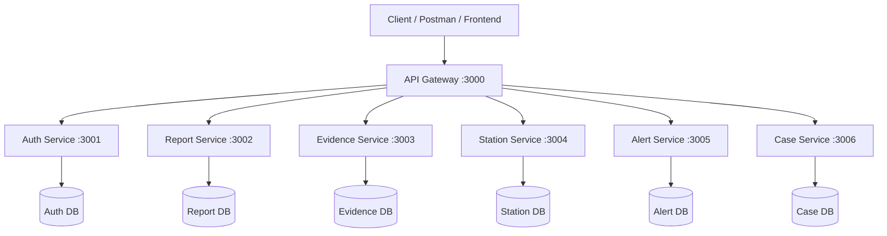
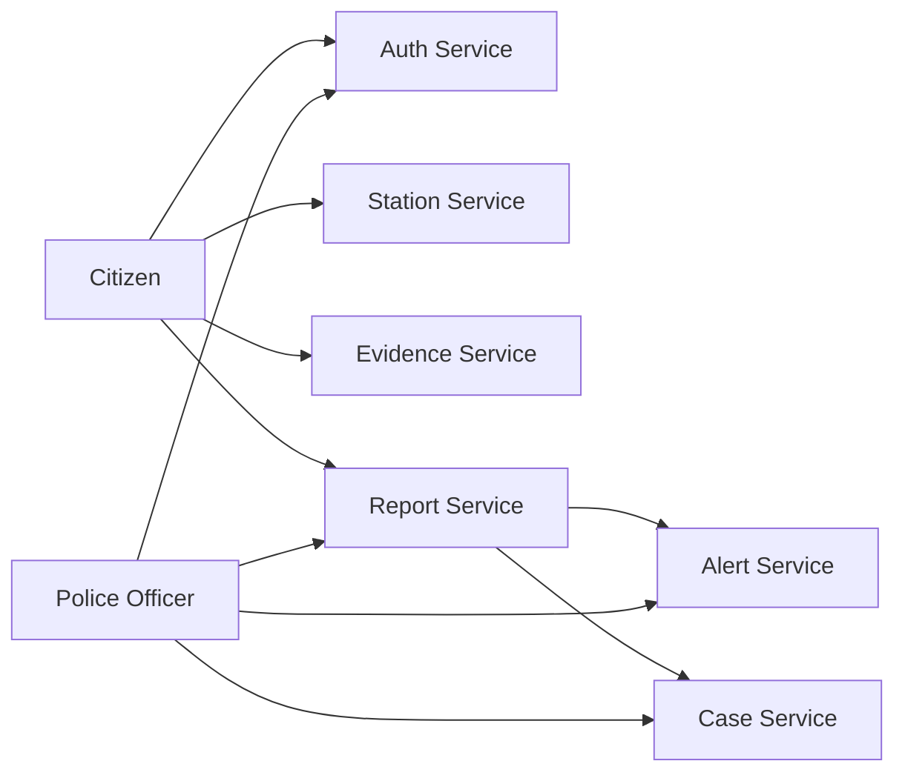
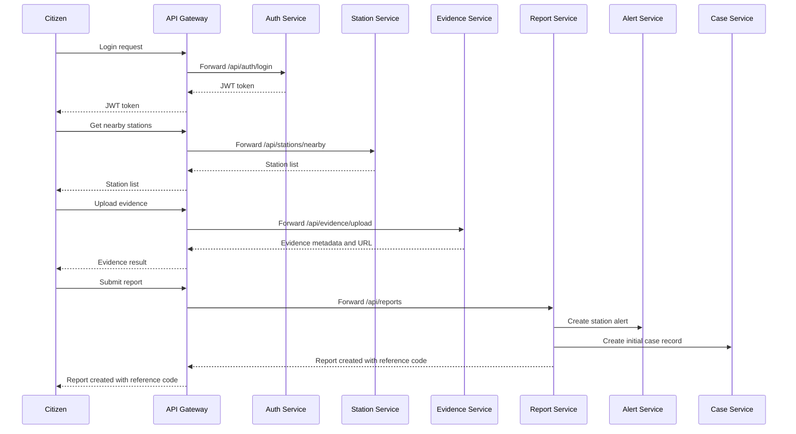

# SL-PRRS Team Implementation Guide

## 1. Document Purpose

This document is the final team reference for the **SL-PRRS** assignment.

It is written to give every team member a full understanding of:

- the business idea
- the assignment expectations
- the overall system architecture
- the purpose of the API Gateway
- the role of each microservice
- the data owned by each service
- the request flow between services
- the recommended folder structure
- the main implementation rules for the team
- the testing and presentation checklist

This document should help the team stay aligned during development and presentation.

## 2. Project Title

**SL-PRRS: Sri Lanka Police Rapid Report System**

## 3. Project Summary

SL-PRRS is an academic MVP backend system for citizen incident reporting. The idea is to allow citizens to submit incident reports digitally, upload supporting evidence, choose the police station that should receive the report, and track progress later using a reference code.

Police officers can review assigned alerts and update the current case status.

This is **not** being presented as a production-ready national police platform. It is a **microservices-based academic solution** designed to satisfy the assignment requirements in a realistic and technically defendable way.

## 4. Why This Domain Is Good for the Assignment

This domain is a strong choice because:

- it is a real-world scenario
- it has clear users and business operations
- it naturally separates into multiple subdomains
- each subdomain can be built as an independent microservice
- it gives a clear reason for using an API Gateway
- it is easy to explain in a slide deck and demo

## 5. Assignment Alignment

The assignment asks for:

- a real-world scenario
- microservice decomposition
- one microservice per group member
- an API Gateway
- proper folder structure
- Swagger documentation
- screenshots of direct endpoints and gateway endpoints
- a final solution without build breaks or runtime errors

SL-PRRS supports all of those requirements.

## 6. System Vision

The vision of the MVP is simple:

1. A citizen logs in.
2. The citizen finds a relevant police station.
3. The citizen uploads supporting evidence.
4. The citizen submits an incident report.
5. The system generates a reference code.
6. The relevant station receives an alert.
7. A case record is maintained for status tracking.
8. The citizen can check progress later.

## 7. Scope of the MVP

The MVP will include:

- registration and login
- simple role support
- station listing and nearby lookup
- incident report submission
- image upload for evidence
- reference-code based report tracking
- station alerts
- case status updates
- API Gateway routing
- Swagger documentation for all services

The MVP will **not** include:

- government-grade identity verification
- SMS or email delivery
- advanced admin dashboards
- full live push notification delivery
- production-grade media access control
- large-scale deployment features

## 8. Users and Roles

### Citizen

- registers and logs in
- searches for police stations
- uploads evidence
- submits incident reports
- tracks report or case progress

### Police Officer

- logs in
- views alerts for their station
- views reports assigned to their station
- updates case status

### Demo Administrator or Seed User

- can exist only for assignment/demo convenience
- may manage seeded station data if required by implementation

## 9. High-Level Architecture

The system uses a microservices architecture. Each microservice:

- runs independently
- has its own database
- handles one business capability
- exposes its own REST API
- has its own Swagger documentation

All external client requests can also be routed through a single API Gateway.

### 9.1 High-Level Component Diagram



### 9.2 Service Interaction Diagram



## 10. Why the API Gateway Is Important

Without an API Gateway, clients would need to know multiple ports such as `3001`, `3002`, `3003`, and so on. That is inconvenient and becomes harder to manage as the number of services grows.

The API Gateway solves this by providing:

- one client-facing entry point
- centralized routing
- simpler testing and demo access
- an example of a core microservices pattern

### Example

Direct service access:

- `http://localhost:3002/api/reports`

Gateway access:

- `http://localhost:3000/api/reports`

The gateway hides the internal service port from the client.

## 11. Port Allocation and Route Mapping

| Component | Port | Main Route Prefix |
|---|---:|---|
| API Gateway | 3000 | all client traffic |
| Auth Service | 3001 | `/api/auth` |
| Report Service | 3002 | `/api/reports` |
| Evidence Service | 3003 | `/api/evidence` |
| Station Service | 3004 | `/api/stations` |
| Alert Service | 3005 | `/api/alerts` |
| Case Service | 3006 | `/api/cases` |

## 12. Core End-to-End Request Flow



## 13. Microservice Design Principles

Each microservice should follow these rules:

- one service owns one main business capability
- one service owns one database
- services communicate only through HTTP APIs
- no service directly queries another service database
- each service must be runnable on its own
- each service must expose Swagger at its own native URL
- each service should still be accessible through the gateway

## 14. Detailed Microservice Specifications

## 14.1 Auth Service

### Purpose

The Auth Service manages registration, login, user identity, and role-based access for the MVP.

### Why It Exists as a Separate Service

Authentication is a separate concern from reporting, evidence, and case management. Keeping it isolated makes the system easier to organize and reuse.

### Main Responsibilities

- register users
- authenticate users
- issue JWT tokens
- validate JWT tokens
- expose user profile details

### Suggested Endpoints

| Method | Endpoint | Purpose |
|---|---|---|
| POST | `/api/auth/register` | register a citizen or officer |
| POST | `/api/auth/login` | authenticate user and issue token |
| GET | `/api/auth/profile` | get current user profile |
| GET | `/api/auth/verify` | internal token validation |
| GET | `/api/auth/health` | health check |

### Example Data Fields

- `id`
- `name`
- `email` or `phone`
- `password_hash`
- `role`
- `created_at`

### Notes

- keep identity handling simple for the assignment
- use hashed passwords
- role values can be `citizen` and `officer`

## 14.2 Report Service

### Purpose

The Report Service is the core business service. It stores incident reports and returns a tracking reference code.

### Why It Exists as a Separate Service

Incident reports are the central business records of the system and deserve their own ownership and database.

### Main Responsibilities

- create a report
- list a citizen's reports
- list station-level reports
- get report by reference code
- trigger downstream actions after report creation

### Suggested Endpoints

| Method | Endpoint | Purpose |
|---|---|---|
| POST | `/api/reports` | create a new report |
| GET | `/api/reports/my` | get reports submitted by current user |
| GET | `/api/reports/station/:stationId` | get reports for a station |
| GET | `/api/reports/track/:referenceCode` | track a report by code |
| GET | `/api/reports/:id` | get full report details |
| GET | `/api/reports/health` | health check |

### Example Data Fields

- `id`
- `citizen_id`
- `station_id`
- `incident_type`
- `description`
- `location_text`
- `latitude`
- `longitude`
- `is_privacy_mode`
- `reference_code`
- `status`
- `created_at`

### Notes

- a reference code should always be generated
- keep incident types controlled, for example `theft`, `assault`, `accident`, `harassment`, `other`
- after report creation, call Alert Service and Case Service

## 14.3 Evidence Service

### Purpose

The Evidence Service handles evidence upload and file metadata.

### Why It Exists as a Separate Service

File management is very different from report management. Separating it keeps the Report Service focused on business data and makes the design more modular.

### Main Responsibilities

- upload image evidence
- store evidence metadata
- retrieve evidence by report
- serve uploaded evidence files

### Suggested Endpoints

| Method | Endpoint | Purpose |
|---|---|---|
| POST | `/api/evidence/upload` | upload evidence file |
| GET | `/api/evidence/:filename` | serve uploaded file |
| GET | `/api/evidence/report/:reportId` | get all evidence for a report |
| DELETE | `/api/evidence/:id` | delete evidence if allowed |
| GET | `/api/evidence/health` | health check |

### Example Data Fields

- `id`
- `report_id`
- `original_filename`
- `stored_filename`
- `mime_type`
- `file_size`
- `uploaded_by`
- `created_at`

### Notes

- for the MVP, prioritize image upload first
- allow video only if the team finishes the core system without risk
- store metadata in the database and files in an uploads folder

## 14.4 Station Service

### Purpose

The Station Service manages the police station directory and location-based station lookup.

### Why It Exists as a Separate Service

Station data belongs to a separate domain. It may be read by many features, but it should still be owned in one place.

### Main Responsibilities

- list all stations
- return station details
- filter stations by district
- find nearby stations by coordinates

### Suggested Endpoints

| Method | Endpoint | Purpose |
|---|---|---|
| GET | `/api/stations` | list stations |
| GET | `/api/stations/:id` | get station details |
| GET | `/api/stations/nearby` | return nearby stations |
| POST | `/api/stations` | add a station if needed |
| PUT | `/api/stations/:id` | update station if needed |
| GET | `/api/stations/health` | health check |

### Example Data Fields

- `id`
- `name`
- `district`
- `division`
- `address`
- `contact_number`
- `latitude`
- `longitude`

### Notes

- use seeded sample station data
- do not overclaim full real-world national data completeness

## 14.5 Alert Service

### Purpose

The Alert Service creates and manages station-level alerts whenever a new report is submitted.

### Why It Exists as a Separate Service

Alerting is a different concern from storing the report itself. By separating it, the system better demonstrates microservice boundaries.

### Main Responsibilities

- create alert records
- show unread alerts for a station
- mark alerts as read
- provide alert summary counts

### Suggested Endpoints

| Method | Endpoint | Purpose |
|---|---|---|
| POST | `/api/alerts` | create an alert |
| GET | `/api/alerts/station/:stationId` | get alerts for a station |
| PUT | `/api/alerts/:id/read` | mark alert as read |
| GET | `/api/alerts/stats/:stationId` | get alert counts |
| GET | `/api/alerts/health` | health check |

### Example Data Fields

- `id`
- `station_id`
- `report_id`
- `message`
- `is_read`
- `created_at`

### Notes

- describe this as stored alert generation, not advanced real-time delivery
- if needed later, live notification can be mentioned as future work

## 14.6 Case Service

### Purpose

The Case Service tracks the progress of reports after submission.

### Why It Exists as a Separate Service

Case lifecycle management is different from initial report submission. This separation shows a mature decomposition of responsibilities.

### Main Responsibilities

- create an initial case record
- update current case status
- maintain case history
- return tracking data for citizens and officers

### Suggested Endpoints

| Method | Endpoint | Purpose |
|---|---|---|
| GET | `/api/cases/:reportId` | get case timeline |
| GET | `/api/cases/track/:referenceCode` | track case by reference code |
| PUT | `/api/cases/:reportId/status` | update case status |
| GET | `/api/cases/station/:stationId` | get station cases |
| GET | `/api/cases/health` | health check |

### Example Data Fields

- `id`
- `report_id`
- `station_id`
- `current_status`
- `officer_note`
- `updated_by`
- `updated_at`

### Suggested Status Lifecycle

- `PENDING`
- `RECEIVED`
- `INVESTIGATING`
- `RESOLVED`

### Notes

- maintain status history, not just the latest status
- let citizens track using the report reference code

## 15. Data Ownership Summary

| Service | Owns |
|---|---|
| Auth Service | users, credentials, roles |
| Report Service | reports, report metadata, reference codes |
| Evidence Service | file metadata and upload records |
| Station Service | station directory and location data |
| Alert Service | station alerts |
| Case Service | case state and case history |

This ownership model is important because it prevents hidden coupling between services.

## 16. Suggested Database Tables

This section gives the team a simple starting point.

### Auth Service Tables

- `users`

### Report Service Tables

- `reports`

### Evidence Service Tables

- `evidence_files`

### Station Service Tables

- `stations`

### Alert Service Tables

- `alerts`

### Case Service Tables

- `cases`
- `case_history`

## 17. Inter-Service Communication

Inter-service communication should happen through HTTP requests.

### Main Internal Calls

- Report Service -> Alert Service
- Report Service -> Case Service
- API Gateway -> every microservice
- optionally Auth Service verification endpoint -> other services

### Example Internal Event Logic

When a report is created:

1. Report Service stores the report.
2. Report Service generates the reference code.
3. Report Service calls Alert Service to create a station alert.
4. Report Service calls Case Service to create the initial case state.

## 18. Recommended Folder Structure

```text
slprs/
  api-gateway/
    src/
      index.js
      routes/
      config/
      middleware/
    package.json
    .env.example

  auth-service/
    src/
      index.js
      routes/
      controllers/
      services/
      repositories/
      middleware/
      validators/
      db/
      docs/
    package.json
    .env.example

  report-service/
    src/
      index.js
      routes/
      controllers/
      services/
      repositories/
      middleware/
      validators/
      db/
      docs/
    package.json
    .env.example

  evidence-service/
    src/
      index.js
      routes/
      controllers/
      services/
      repositories/
      middleware/
      validators/
      db/
      docs/
    uploads/
    package.json
    .env.example

  station-service/
    src/
      index.js
      routes/
      controllers/
      services/
      repositories/
      middleware/
      validators/
      db/
      docs/
    package.json
    .env.example

  alert-service/
    src/
      index.js
      routes/
      controllers/
      services/
      repositories/
      middleware/
      validators/
      db/
      docs/
    package.json
    .env.example

  case-service/
    src/
      index.js
      routes/
      controllers/
      services/
      repositories/
      middleware/
      validators/
      db/
      docs/
    package.json
    .env.example

  README.md
```

## 19. Technology Stack

| Category | Recommended Technology |
|---|---|
| Runtime | Node.js |
| Web framework | Express.js |
| Database | SQLite with `better-sqlite3` |
| API Gateway | `http-proxy-middleware` |
| Authentication | `jsonwebtoken` |
| Password hashing | `bcryptjs` |
| File upload | `multer` |
| HTTP client | `axios` |
| API documentation | `swagger-jsdoc`, `swagger-ui-express` |
| Geolocation helper | `geolib` |
| Logging | `morgan` |
| CORS | `cors` |

## 20. Engineering Standards for the Team

To make the project look more like Associate Software Engineer work, all services should follow the same engineering standards.

### Required Standards

- same response format style across services
- input validation on every route
- error handling middleware
- health check route
- logging enabled
- `.env` file support
- clear startup messages
- database initialization on startup
- Swagger on every service

### Example Response Format

Success response:

```json
{
  "success": true,
  "message": "Report created successfully",
  "data": {
    "id": "rep_001",
    "referenceCode": "RX7K2P9M"
  }
}
```

Error response:

```json
{
  "success": false,
  "message": "Validation failed",
  "errors": [
    "stationId is required",
    "incidentType is required"
  ]
}
```

## 21. Security and Privacy Positioning

The team should present privacy carefully.

Use this safer position:

- the MVP supports a privacy-oriented reporting mode
- the system uses a generated reference code for tracking
- identity exposure is reduced in normal workflows
- this is not a claim of full production-grade anonymity

Avoid making claims such as:

- "identity can never be recovered"
- "full government-grade identity verification"
- "military-grade evidence protection"

Those claims are too strong for the assignment and can be challenged in presentation.

## 22. Suggested Team Work Allocation

| Member | Main Ownership | Extra Responsibility |
|---|---|---|
| Member 1 | Auth Service | auth patterns and JWT guidance |
| Member 2 | Report Service | main business flow coordination |
| Member 3 | Evidence Service | file handling and upload rules |
| Member 4 | Station Service | seed data and geo lookup |
| Member 5 | Alert Service | internal service communication |
| Member 6 | Case Service | case lifecycle and tracking flow |

Shared team responsibilities:

- API Gateway
- integration testing
- route naming consistency
- Swagger verification
- slide deck preparation

## 23. Suggested Development Timeline

### Day 1

- create all service folders
- install dependencies
- add base Express apps
- configure ports
- set up Swagger
- add health routes

### Day 2

- complete Auth Service
- complete Station Service
- complete Report Service basics

### Day 3

- complete Evidence Service
- complete Alert Service
- complete Case Service

### Day 4

- integrate services
- test internal calls
- verify gateway routing
- fix response format issues

### Day 5

- full testing
- capture screenshots
- finalize slide deck
- rehearse team explanation

## 24. Testing Checklist

Each service should be tested directly and through the gateway.

### Direct Service Testing

- native service port runs successfully
- Swagger UI opens successfully
- health endpoint works
- at least two main endpoints work correctly

### Gateway Testing

- same endpoint works through `localhost:3000`
- Swagger paths through the gateway work
- route forwarding is correct
- no path conflicts occur between services

### Integration Testing

- citizen can register/login
- station lookup works
- evidence upload works
- report submission works
- alert is created
- case record is created
- officer can update status
- citizen can track using the reference code

## 25. Swagger and Demo Expectations

The assignment explicitly values Swagger evidence.

Each service should provide:

- a native Swagger URL
- a gateway-accessible Swagger URL
- route descriptions
- request body descriptions
- response descriptions

### Example Native URLs

- `http://localhost:3001/api-docs`
- `http://localhost:3002/api-docs`
- `http://localhost:3003/api-docs`

### Example Gateway URLs

- `http://localhost:3000/api/auth/api-docs`
- `http://localhost:3000/api/reports/api-docs`
- `http://localhost:3000/api/evidence/api-docs`

The exact proxied Swagger route depends on your gateway configuration, so the team must keep it consistent.

## 26. Presentation Guidance for the Team

Each member should be able to explain:

- why their service exists
- what data their service owns
- what endpoints their service exposes
- how their service communicates with others
- how the API Gateway helps the architecture

The team should sound consistent when presenting these key messages:

- this is an academic MVP
- scope was intentionally controlled to ensure reliability
- each service has clear ownership
- the gateway simplifies external access
- the system demonstrates microservices practically, not only theoretically

## 27. Risks and How to Avoid Them

### Risk 1: Overbuilding

Problem:

- too many features increase bugs and integration failures

Solution:

- finish core MVP first
- do not add optional features before the system is stable

### Risk 2: Inconsistent Route Design

Problem:

- services may use different naming and response styles

Solution:

- agree route naming and response format before implementation

### Risk 3: Swagger Not Working

Problem:

- endpoints may work but Swagger may be incomplete or broken

Solution:

- test Swagger from day one, not at the end

### Risk 4: Gateway Path Confusion

Problem:

- incorrect proxy prefixes may break routes or Swagger paths

Solution:

- define gateway prefixes early and keep them fixed

### Risk 5: Runtime Errors During Demo

Problem:

- unhandled exceptions can damage confidence in the final demonstration

Solution:

- add validation, try/catch, health checks, and startup checks in every service

## 28. Final Recommendation

The team should build and present SL-PRRS as a **clean, stable, well-scoped academic MVP**.

That means:

- do not overclaim
- keep service boundaries clear
- keep Swagger working
- keep routes consistent
- keep the gateway simple
- prioritize a stable demo over extra features

If the team follows this document, the result will be easier to implement, easier to explain, and much more aligned with an Associate Software Engineer level submission.

## 29. Quick Summary for the Team

- six services, one per member
- one API Gateway
- one database per service
- direct and gateway endpoint access
- Swagger for every service
- controlled MVP scope
- clean architecture
- reliable demo

That is the strongest position for this assignment.
